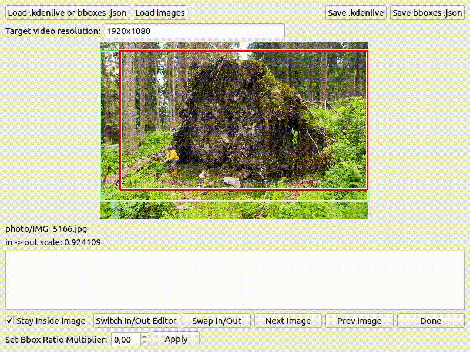
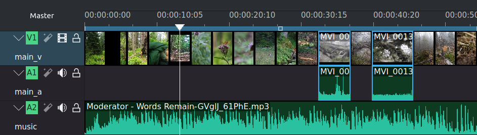
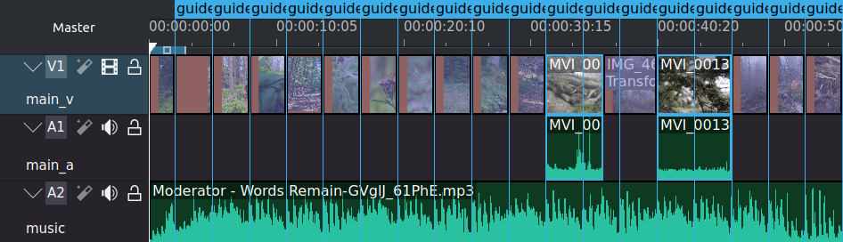

# Kdenlive Slideshow Editor

Simplify creation of photo/video slideshows in Kdenlive with Ken-Burns effect (pan & zoom) and automatic synchronization of transitions to music beats.

You can watch a sample input project here: https://youtu.be/mox07jgtXmU

And the result after processing it in the slideshow editor is here: https://youtu.be/lvu-4r3QrZo



## Requirements and building blocks

- [Kdenlive](https://www.kdenlive.org) video editor
- [Kdenlive Slideshow Editor](https://github.com/michalfapso/kdenlive_slideshow_editor)
  - Python3 as a scripting glue
  - PyQt5 for a user interface
  - [madmom](https://github.com/CPJKU/madmom) for automatic beat detection in music
  - [OpenTimelineIO](https://github.com/michalfapso/OpenTimelineIO) - pathed version of `OpenTimelineIO` for working with the kdenlive file format.

# Installation
Create local python virtual environment and install packages:
```sh
sudo apt install python3-virtualenv
cd ~/python_env
virtualenv slideshow
cd slideshow
source bin/activate

# install packages required by application to run
pip install -r requirements.txt

# if you plan development work, you can install packages for application 
# and packages for development with:

pip install -r requirements-dev.txt

git clone https://github.com/michalfapso/kdenlive_slideshow_editor.git

# To test-run the application:
cd kdenlive_slideshow_editor
python3 app.py
```

# Usage

Super-fast tutorial:
1. Create a simple slideshow in Kdenlive (without any transitions), just put there pictures, video clips and some music.
2. Edit start and finish boxes of the Ken-Burns effect using this editor
3. Render the exported project in kdenlive
4. To modify the slideshow, edit the kdenlive file created in the step 1 and iterate this process until you're happy :)

Here are those steps described in more details:

## Step 1: Create a simple slideshow in Kdenlive



Create a basic kdenlive file with pictures, video clips and music track.

1. Run Kdenlive
2. You should have 3 tracks in your project:<br/>
  - **main_v**: video track for pictures and video clips<br/>
  - **main_a**: audio track for audio of your video clips<br/>
  - **music**: audio track for music<br/>
3. Put your photos and video clips to the *main_v* and *main_a* tracks.
  - You can change the default duration of picture clips in Main Menu -> Settings -> Configure Kdenlive -> Default Durations -> Image Clips. The default of 5 seconds is quite slow. Try to use 3 seconds for more dynamic slideshows. The final duration of each clip will be altered by the beat detection of the *music* track
4. Put your music to the *music* track.
5. Save the project to e.g. `~/Videos/kdenlive_slideshow_test/slideshow_test.kdenlive`

## Step 2: Slideshow enhancements using the custom editor


Here, we'll set start and finish boxes of picture clips and align them to match music beats.

1. Open your terminal
2. Load the python virtualenv:
  ```sh
  source ~/python_env/slideshow/bin/activate
  ```
3. Go to the kdenlive project's folder and run the app.py from there:
  ```sh
  cd ~/Videos/kdenlive_slideshow_test/
  python3 ~/python_env/slideshow/kdenlive_slideshow_editor/app.py
  ```
4. Click on the "Load .kdenlive or bboxes.json", select your kdenlive project file there. You can now set start and finish boxes of the Ken-Burns effect for picture clips.
  - The start box is green, finish box is red.
  - Press the TAB key or click on "Switch In/Out Editor" to switch between them
  - Use your mouse wheel to resize the active box
  - Press spacebar or click on "Next Image" to go to the next image in the slideshow.
  - The "Set Bbox Ratio Multiplier" is for modifying the ratio of start and finish boxes of all pictures in the slideshow. It may come handy when you find out that the Ken-Burns effect looks too fast or too slow.
5. Click on the "Save bboxes.json" to save the info about start and finish boxes to a json file as a backup (e.g. to `slideshow_test_bboxes.json`)
  - Next time, when you modify the kdenlive project (adding more pictures, ...), load it again by clicking on the "Load .kdenlive or bboxes.json" button, but then click the button again to load the bboxes json file. All the boxes you set before are loaded in the editor and you can now specify just the boxes of the newly added pictures.
6. Click on the "Save .kdenlive" and save it to another file, e.g. `slideshow_test_out.kdenlive`. Don't overwrite the original kdenlive project.
  - It runs the music beat detector for all audio files in your *music* track and stores the output to `.downbeats` file located in the same folder as the original music file. The beat detection may take a few minutes for the first time, but afterwards it will be instantly loaded from the `.downbeats` file.

## Step 3: Finish the slideshow in Kdenlive



1. Open the exported kdenlive project (e.g. `slideshow_test_out.kdenlive`)
2. You can tweak the slideshow if you want and render it.

## Step 4: Editing iterations

If you want to edit the slideshow (add/remove/rearrange pictures or video clips), do it on the original project file (e.g. `slideshow_test.kdenlive`). Then:

1. Run the `app.py`
1. Load the kdenlive file in the editor
2. Load the boxes json file
3. Set start and finish boxes of newly added pictures (if any)
4. The rest is the same as before.

# License
This project is licensed under the [MIT license](LICENSE.md).
